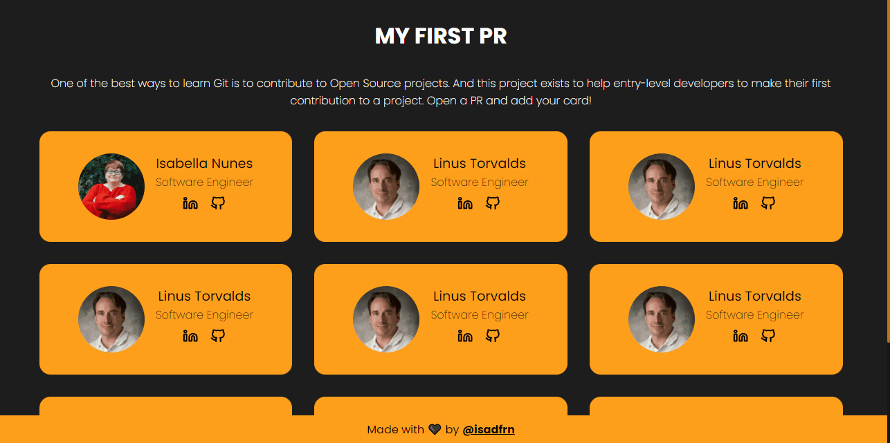

# My First PR




## About

One of the best ways to learn Git is to contribute to Open Source projects. And this project is to help entry-level developers to make their first contribution to a project.

## How to contribute

- Create a fork of this project;
- Add your information on [students.json](./src/data/students.json) file:

```json
{
  "profileImageUrl": "https://github.com/YOUR_GIT_NAME.png",
  "selfDescription": "YOUR SELF DESCRIPTION FOR ACCESSIBILITY",
  "name": "YOUR NAME",
  "title": "YOUT TITLE LIKE - Software Enginner or Software Developer or Full Stacl Developer and so on",
  "linkedinUrl": "https://www.linkedin.com/in/YOUR_USERNAME/",
  "githubUrl": "https://github.com/YOUR_GIT_NAME"
}
```

- Commit your changes;
- Open a pull request and I will review your changes;

## Run

For this projet run `npm install` on root directory for installing all dependencies, then `npm run dev` and access http://127.0.0.1:5173/ on your browser.

## Status

Maintaining ✅

## License

[MIT](./LICENSE)
